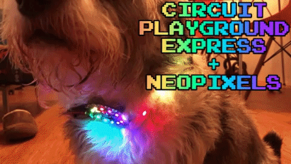
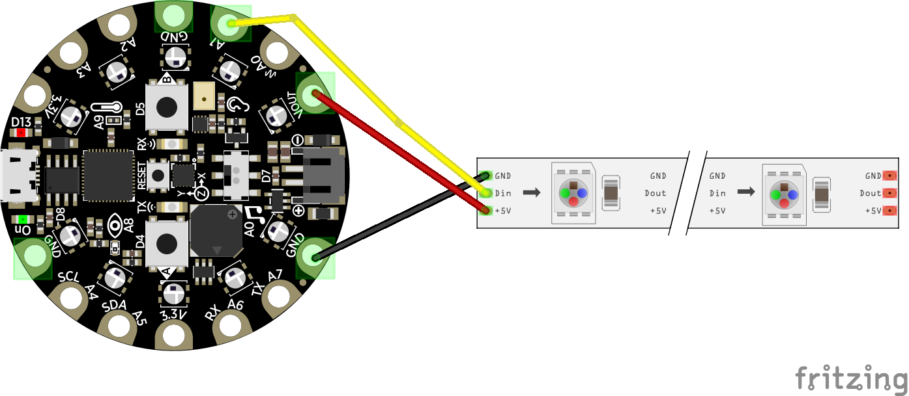

# Circuit Playground Express + NeoPixels DiskoDogCollar ✨

A LED dog collar project to try out [MS MakeCode](https://makecode.adafruit.com/), Javascript, Circuit Playground Express and RGBW Neopixels (30/m strip)

##### See the full build blogpost ---> [here](https://medium.com/@secretsquirrel/i-made-a-led-dog-collar-with-javascript-1c10ff973550).

### Wiring Diagram:

### Coding the Collar:

I coded the collar using the JavaScript editor and the [MakeCode API](https://makecode.adafruit.com/reference/) reference docs. I wanted the collar to do a few different things:

1. It should continually run a rainbow 🌈 animation on the board and strip’s LEDs.
2. If it detects a shake, it should sparkle ✨ randomly on the strip for 1 second.
3. If I press button A, it will turn off all the LEDs.
4. If I press button B, it will turn on the rainbow animations on all LEDs again.

### Collar Demo:

---
### One Happy Little Dog! 👇

---

A project by [✨ Stephanie ✨](https://stephanie.lol)
